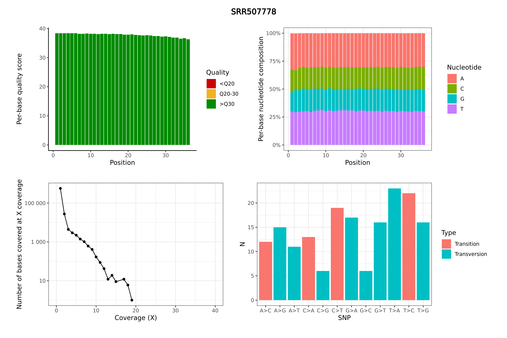

# pipebox

Pipeline in a Docker container

- [Background](#background)
  - [Motivation](#motivation)
  - [Preliminaries](#preliminaries)
- [Demo](#demo)
  - [Build](#build)
  - [Run](#run)
  - [Results](#results)
- [How it works](#how-it-works)
  - [The `Dockerfile`](#the-dockerfile)
  - [The pipeline script](#the-pipeline-script)
  - [The post-processing script](#the-post-processing-script)


## Background

### Motivation

This repository demonstrates how to build an entire data analysis pipeline that runs inside a Docker container. 

Docker is a virtualization technology that can be used to bundle an application and all its dependencies in a virtual container that can be distributed and deployed to run reproducibly on any Windows, Linux or MacOS operating system. Docker is commonly used in computational biology to bundle a tool and all its dependencies such that it can essentially be used as an executable (see the [StaPH-B Docker](https://github.com/StaPH-B/docker-builds) and [slimbioinfo](https://github.com/stephenturner/slimbioinfo) projects for examples). For instance, installing something as simple as `bwa` on a modern ARM Macbook is challenging because of the way M1 Macs compile C code. However, a Docker container can be used where `bwa` can be essentially replaced with `docker run bwa ...`.

However, while containers are typically used to deploy microservices, containerization can also be used to deploy an entire data analysis pipeline. I illustrate this in pipebox using a fairly trivial data analysis pipeline involving read mapping and variant calling.

Inputs: 

1. Paired end reads
1. A reference genome
1. An output base filename

What the pipeline does:

1. If the reference genome isn't indexed, it'll index it with both `samtools faidx` and `bwa index`.
1. Very simple QC on the sequencing reads using `seqtk`.
1. Use `bwa mem` to map reads to the indexed reference genome.
1. Very simple QC on the alignments with `samtools stats`.
1. Use `bcftools mpileup` and `bcftools call` to call variants.
1. Very simple QC on the alignments with `samtools stats`.
1. Very simple QC on the variant calls with `bcftools stats`.
1. Creates a simple single page PDF "report" with a few plots from the QC steps.

All of these data processing steps happen _inside the container_. You provide a volume mount to the container so that you can mount the local filesystem to a location inside the running container. Data processing happens inside the container. Output files are also written to a location that is mounted to the container (e.g., the present working directory). This pipeline will run on any system where Docker is available. 

### Preliminaries

FIXME assumed knowledge

## Demo

### Build

First, get this repository and build the pipebox image.

```sh
git clone git@github.com:colossal-compsci/pipebox.git
cd pipebox
docker build --tag pipebox .
```

### Run

Running the container with no arguments prints a minimal help message (we use `--rm` to destroy the container when it exits). The pipebox container is running the [pipebox.sh](src/pipebox.sh) script as its `ENTRYPOINT`, which runs the entire pipeline.

```sh
docker run --rm pipebox
```

```
Usage: pipebox.sh <read1> <read2> <reffa> <outbase>
```

Let's run it on the [test data in this repository](testdata). The `-v $(pwd):(pwd)` mounts the present working directory on the host system to a path of the same name inside the container, while the `-w $(pwd)` _sets_ the working directory inside the container to the same directory specified by the volume mount. These two flags make it easy to make data on the host accessible to the running container.

```sh
cd testdata
docker run --rm -v $(pwd):$(pwd) -w $(pwd) pipebox \
    SRR507778_1.fastq.gz \
    SRR507778_2.fastq.gz \
    yeastref.fa.gz \
    results/SRR507778
```

### Results

You should see all the files in the `testdata/results` folder:

- [`SRR507778.seqtkfqchk.tsv`](testdata/results/SRR507778.seqtkfqchk.tsv): Results from running `seqtk fqchk` after interleaving the paired FASTQ files.
- [`SRR507778.bam`](testdata/results/SRR507778.bam): Sorted alignment.
- [`SRR507778.samtoolsstats.tsv`](testdata/results/SRR507778.samtoolsstats.tsv): Results from running `samtools stats` on this alignment.
- [`SRR507778.vcf.gz`](testdata/results/SRR507778.vcf.gz): Results from variant calling against the reference genome.
- [`SRR507778.bcfstats.tsv`](testdata/results/SRR507778.bcfstats.tsv): Results from running `bcftools stats` on these variant calls.
- [`SRR507778.metrics.pdf`](testdata/results/SRR507778.metrics.pdf): "Report" compiling a few outputs from each of the tools above (PDF format).
- [`SRR507778.metrics.png`](testdata/results/SRR507778.metrics.png): "Report" compiling a few outputs from each of the tools above (PNG format).



