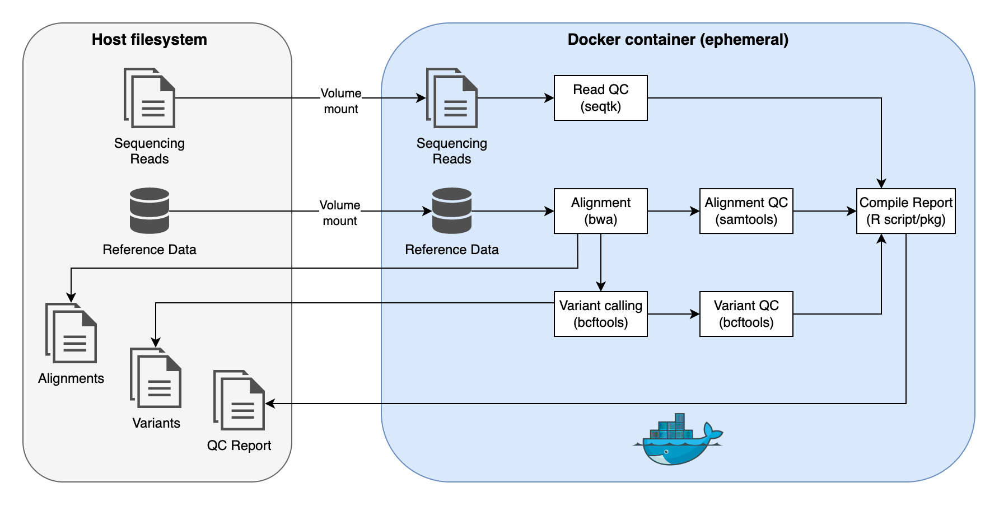
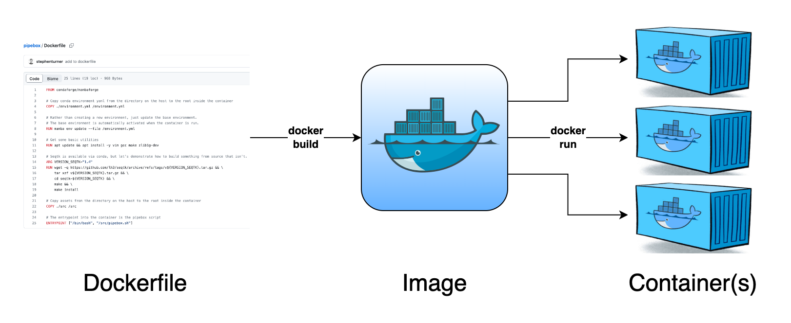

# pipebox

<!-- SOFTWARE pipebox -->
<!-- VERSION 1.0.0 -->

Pipeline in a Docker container

- [Background](#background)
  - [Motivation](#motivation)
  - [Preliminaries](#preliminaries)
- [Demo](#demo)
  - [Build](#build)
  - [Run](#run)
  - [Results](#results)
- [How it works](#how-it-works)
  - [The `Dockerfile`](#the-dockerfile)
  - [The pipeline script](#the-pipeline-script)
  - [The post-processing script](#the-post-processing-script)
- [For developers](#for-developers)

<!--

# Build and ship: 
# export GHCR_PAT="YOUR_TOKEN_HERE"
# echo $GHCR_PAT | docker login ghcr.io -u USERNAME --password-stdin
docker build build --no-cache --tag pipebox:latest --tag ghcr.io/colossal-compsci/pipebox:latest .
docker push ghcr.io/colossal-compsci/pipebox:latest

-->

## Background

### Motivation

This repository demonstrates how to build an entire data analysis pipeline that runs inside a Docker container. 

Docker is a virtualization technology that can be used to bundle an application and all its dependencies in a virtual container that can be distributed and deployed to run reproducibly on any Windows, Linux or MacOS operating system. Docker is commonly used in computational biology to bundle a tool and all its dependencies such that it can essentially be used as an executable (see the [StaPH-B Docker](https://github.com/StaPH-B/docker-builds) and [slimbioinfo](https://github.com/stephenturner/slimbioinfo) projects for examples). For instance, installing something as simple as `bwa` on a modern ARM Macbook is challenging because of the way M1 Macs compile C code. However, a Docker container can be used where `bwa` can be essentially replaced with `docker run bwa ...`.

However, while containers are typically used to deploy microservices, containerization can also be used to deploy an entire data analysis pipeline. I illustrate this in pipebox using a fairly trivial data analysis pipeline involving read mapping and variant calling.

Inputs: 

1. Paired end reads
1. A reference genome
1. An output base filename

What the pipeline does:

1. If the reference genome isn't indexed, it'll index it with both `samtools faidx` and `bwa index`.
1. Very simple QC on the sequencing reads using `seqtk`.
1. Use `bwa mem` to map reads to the indexed reference genome.
1. Very simple QC on the alignments with `samtools stats`.
1. Use `bcftools mpileup` and `bcftools call` to call variants.
1. Very simple QC on the alignments with `samtools stats`.
1. Very simple QC on the variant calls with `bcftools stats`.
1. Creates a simple single page PDF "report" with a few plots from the QC steps.

All of these data processing steps happen _inside the container_. You provide a volume mount to the container so that you can mount the local filesystem to a location inside the running container. Data processing happens inside the container. Output files are also written to a location that is mounted to the container (e.g., the present working directory). This pipeline will run on any system where Docker is available. 



### Preliminaries

This repo assumes a minimal working understanding of containerization, including the difference between an image and a container, and how they're each created. If you're familiar with all these concepts, you can skip to the [Demo](#demo) section below.

A Docker _image_ is like a blueprint or a snapshot of what a container will look like when it runs. Images are _created from code_ using a Dockerfile, which is a set of instructions used to create the image. This is important, because with Dockerfiles we can _define infrastructure in code_ -- code which can be easily version controlled and worked on collaboratively in a platform like GitHub. When we have our instructions for building an image written out in a Dockerfile, we can create an image using `docker build`.

Once we have an image, we can "rehydrate" that image and bring to life a running _container_ using `docker run`. When a container is initialized, it spins up, does whatever it needs to do, and is destroyed. A container could serve a long-running process, such as a webservice or database. Here, we're spinning up a container that runs a script _inside that container_. When the script runs to completion, the container is destroyed. From a single image we can use `docker run` to spin up one running container or one thousand running containers, all starting from the identical image. 



Another important concept is a _volume mount_. A running container is a virtualized operating system with its own software and importantly, its own _filesystem_ inside the container. If we have a plain Alpine linux container and run something like `docker run alpine ls`, this will start the alpine container and run `ls` in the default working directory, which is `/`, _inside the container_. That is, you'll see the usual system folders like `/bin`, `/dev`, `/etc`, and others. If you were to run `docker run alpine ls /home` you'll see _nothing_ - because the container has no users other than root! 

This concept is important because if you're running tools inside the container, you must provide a way to have files on the host system (i.e., your computer or VM) to be accessible to the running container. To do this we use the `--volume` or more commonly the short `-v` flag, which allows us to mount local directories to the container. For instance, `docker run -v /home/turner/mydata:/data` would mount `/home/turner/mydata` from my laptop to `/data` inside the running container. If I have a script that expects to see data in `/data` inside the container, this would work well. 

Here's a common trick that allows you to mount contents of the present working directory on your machine to the running container using shell substitution with `$(pwd)`. Using `-v $(pwd):(pwd)` mounts the present working directory on the host system to a path of the same name inside the container, and `-w $(pwd)` _sets_ the working directory inside the container to the same directory specified by the volume mount. 

Further suggested reading:

- **StaPH-B docker user guide**: https://staphb.org/docker-builds/. This is an excellent guide to using Docker in bioinformatics written by a group of bioinformaticians working in public health labs. Start with the chapters in the upper-right. Specifically useful are the [running containers chapter](https://staphb.org/docker-builds/run_containers/) which provides additional detail on volume mounts, and [developing containers chapter](https://staphb.org/docker-builds/make_containers/) which discusses creating Dockerfiles, building images, and initializing containers. 
- **"Ten simple rules for writing Dockerfiles for reproducible data science."** _PLoS computational biology_ 16.11 (2020): e1008316. DOI:[10.1371/journal.pcbi.1008316](https://doi.org/10.1371/journal.pcbi.1008316). This paper provides a great overview on containerization with a specific focus on the importance of Dockerfiles for reproducible data science and bioinformatics workflows.
- **"pracpac: Practical R Packaging with Docker."** arXiv:2303.07876 (2023). DOI:[10.48550/arXiv.2303.07876](https://doi.org/10.48550/arXiv.2303.07876). Shameless self-promo: I wrote this paper and the software it describes for automating the building and deployment of pipelines-as-Docker-containers with specific attention to pipelines which require a custom-built R package as part of the pipeline. The software is implemented as an R package and it's R-centric (Shiny, MLOps with tidymodels, etc.), but isn't limited solely to R and R-related tools, as demonstrated in the package vignettes.


## Demo

### Build

First, get this repository and build the pipebox image.

```sh
git clone git@github.com:colossal-compsci/pipebox.git
cd pipebox
docker build --tag pipebox .
```

Alternatively, [create a personal access token](https://github.com/settings/tokens) with read permissions for the GitHub Container Registry, login (once), then [pull the container directly from the GitHub Container Registry](https://ghcr.io/colossal-compsci/pipebox).

```sh
## Run once
# export GHCR_PAT="YOUR_TOKEN_HERE"
# echo $GHCR_PAT | docker login ghcr.io -u USERNAME --password-stdin

# Pull the image
docker pull ghcr.io/colossal-compsci/pipebox

# Give it a short name so you can run it more easily
docker tag ghcr.io/colossal-compsci/pipebox pipebox
```

### Run

Running the container with no arguments prints a minimal help message (we use `--rm` to destroy the container when it exits). The pipebox container is running the [pipebox.sh](src/pipebox.sh) script as its `ENTRYPOINT`, which runs the entire pipeline.

```sh
docker run --rm pipebox
```

```
Usage: pipebox.sh <read1> <read2> <reffa> <outbase>
```

Let's run it on the [test data in this repository](testdata). The `-v $(pwd):(pwd)` mounts the present working directory on the host system to a path of the same name inside the container, while the `-w $(pwd)` _sets_ the working directory inside the container to the same directory specified by the volume mount. These two flags make it easy to make data on the host accessible to the running container.

```sh
cd testdata
docker run --rm -v $(pwd):$(pwd) -w $(pwd) pipebox \
    SRR507778_1.fastq.gz \
    SRR507778_2.fastq.gz \
    yeastref.fa.gz \
    results/SRR507778
```

### Results

You should see all the files in the `testdata/results` folder:

- [`SRR507778.seqtkfqchk.tsv`](testdata/results/SRR507778.seqtkfqchk.tsv): Results from running `seqtk fqchk` after interleaving the paired FASTQ files.
- [`SRR507778.bam`](testdata/results/SRR507778.bam): Sorted alignment.
- [`SRR507778.samtoolsstats.tsv`](testdata/results/SRR507778.samtoolsstats.tsv): Results from running `samtools stats` on this alignment.
- [`SRR507778.vcf.gz`](testdata/results/SRR507778.vcf.gz): Results from variant calling against the reference genome.
- [`SRR507778.bcfstats.tsv`](testdata/results/SRR507778.bcfstats.tsv): Results from running `bcftools stats` on these variant calls.
- [`SRR507778.metrics.pdf`](testdata/results/SRR507778.metrics.pdf): "Report" compiling a few outputs from each of the tools above (PDF format).
- [`SRR507778.metrics.png`](testdata/results/SRR507778.metrics.png): "Report" compiling a few outputs from each of the tools above (PNG format).


## How it works

### The `Dockerfile`

Let's start with a look at the [Dockerfile](Dockerfile). Rather than starting this image with a vanilla Debian or Ubuntu image, we actually start from an image that already has mamba (a faster/better conda) installed. If you're interested you can see how this image is built looking at its [Dockerfile in the conda-forge/miniforge-images GitHub repo](https://github.com/conda-forge/miniforge-images/blob/master/ubuntu/Dockerfile).

```Dockerfile
FROM condaforge/mambaforge
```

Next, we copy the [environment.yml](environment.yml) file in _this_ repo, which lives on the host system, into the container at `/`. Take a look at this [environment.yml](environment.yml) file. This defines all the dependencies we want to install via conda, and specifies the versions of some tools. Note that the name of the conda environment is `base` -- that's because rather than creating a new conda environment with a different name, we'll just install all this stuff in the base environment, which is the environment that's running when this container spins itself up. The `RUN` command runs the command inside the container image build to update the base environment with the YAML file that was copied into `/` from the `COPY` statement above.

```Dockerfile
COPY ./environment.yml /environment.yml
RUN mamba env update --file /environment.yml
```

In the next section, we're going to install seqtk from source. Seqtk is available via conda, but I want to demonstrate how to build something from source that might not be available via conda. First I need to install some basic utilities. The GNU C compiler, Make, and the zlib developmental libraries. I'm also installing vim in case I need to step into the running container and edit something while debugging. Next, I set a build variable specifying the version of seqtk I want to use, then set about downloading the source code, compiling from source, and installing inside the container image.

```Dockerfile
RUN apt update && apt install -y vim gcc make zlib1g-dev
ARG VERSION_SEQTK="1.4"
RUN wget -q https://github.com/lh3/seqtk/archive/refs/tags/v${VERSION_SEQTK}.tar.gz && \
    tar xzf v${VERSION_SEQTK}.tar.gz && \
    cd seqtk-${VERSION_SEQTK} && \
    make && \
    make install
```

Next, I'm copying the [`src`](src) directory in this repo, and which will be on the host system, into the container build at `/`. This is important in the next step. We'll get to what's in the [`src`](src) directory in the next step. This means that whenever the container is instantiated, all the stuff in [`src`](src) will be available inside the running container at `/src/*`.

```Dockerfile
COPY ./src /src
```

Finally, I declare an ENTRYPOINT. This is the command that's run whenever the docker container is instantiated. It's the script we'll go over next.

```Dockerfile
ENTRYPOINT ["/bin/bash", "/src/pipebox.sh"]
```

### The pipeline script

When the container is initialized, the [pipebox.sh](src/pipebox.sh) pipeline script is run from `/src/pipebox.sh` _inside the container_. This script expects four command-line arguments, as described above. Command line arguments must be specified to locations _relative to the inside of the running container_, hence the `-v $(pwd):$(pwd) -w $(pwd)` trick described above to operate on files living in the present working directory on the host system.

You can view the [pipebox.sh](src/pipebox.sh) script itself to see what's going on. It's doing everything described above in the [Motivation](#motivation) section. Everything here is happening via a shell script, operating on files inside the container, which are usually volume-mounted from the host. This pipeline script could be a shell script, python script, a shell script that launches a Nextflow run (if Nextflow is installed and configured inside the container), or any arbitrary code that's executed inside the running container on files volume-mounted from the host. This pipeline script could call any number of secondary scripts for further processing. In this example, it calls an R script to do post-processing on the results.

### The post-processing script

The last step that the [pipebox.sh](src/pipebox.sh) script performs is that it calls another script, [pipebox-post.R](src/pipebox-post.R), which is an R script that performs postprocessing on the outputs from `seqtk`, `samtools stats`, and `bcftools stats` run by the main script. You can read the code in [pipebox-post.R](src/pipebox-post.R) to get a sense of what it's doing -- essentially reading in and parsing the tabular output from these tools and stitching a few plots together. Outputs are shown above in the [Results](#results) section.

## For developers

The pipebox image can be built with the `latest` and `x.y.z` tag using the [build.sh](build.sh) script in this container, optionally passing the `--no-cache` flag. The version is scraped from a commented version string in this README. The image is also tagged with `latest` and `x.y.z` for the GitHub Container Registry namespace. To build and deploy:

```sh
./build.sh --no-cache
docker push --all-tags <registry>/<namespace>/pipebox
```
